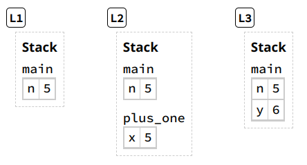
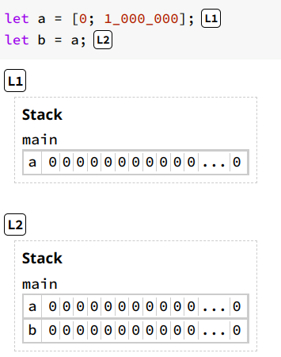
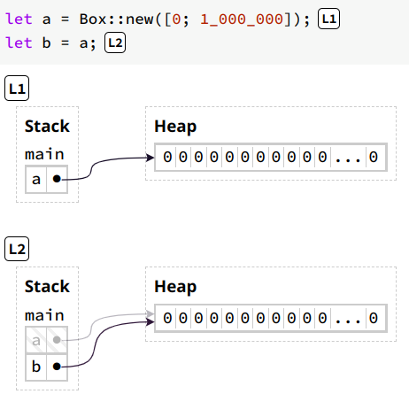
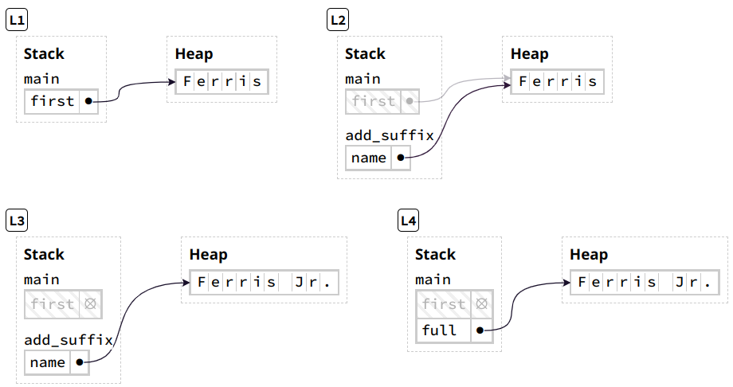
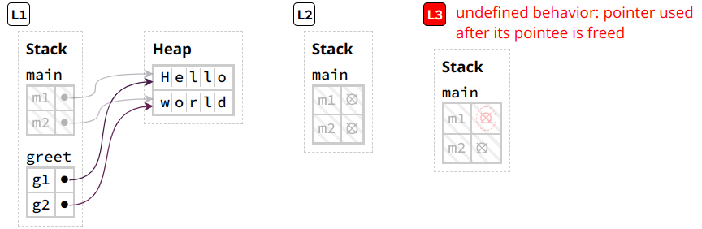
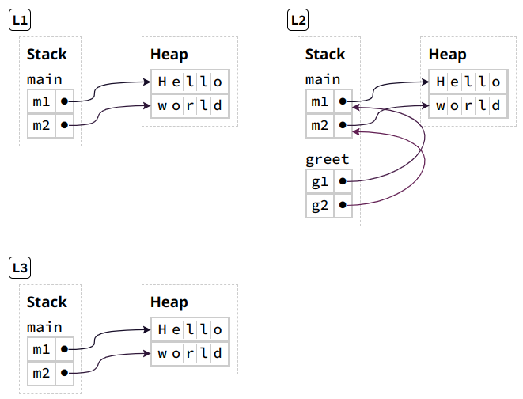
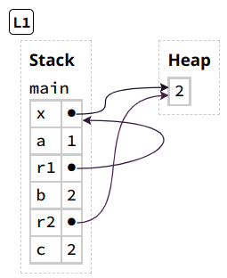
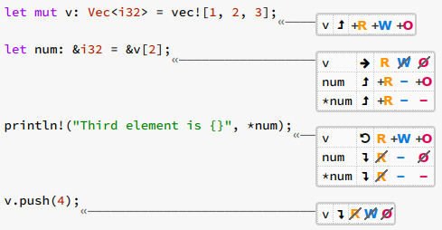
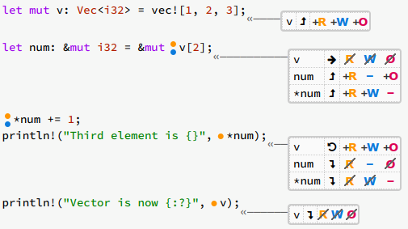
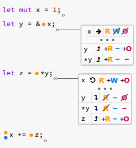

# Rust Key Concepts

## <div align="center">Ownership</div>
### Summary
Ownership is primarily a discipline of heap management:
 - All heap data must be owned by exactly one variable.
 - Rust deallocates heap data once its owner goes out of scope.
 - Ownership can be transferred by moves, which happen on assignments and function calls.
 - Heap data can only be accessed through its current owner, not a previous owner.

### What makes a Rust program safe/unsafe?
one way to think about safety is as the absence of undefined behavior
```rust 
fn read(y: bool) {
    if y {
        println!("y is true!");
    }
}

fn main() {
    read(x); // x isn't defined!
    let x = true;
}
```
 This example is unsafe and does not compile because `read(x)` expects `x` to have a value
 of type `bool`, but `x` doesn't have a value yet

 Rust's goal is to compile programs into efficient binaries that require as few runtime checks as possible. Therefore Rust does not check at runtime whether a variable is defined before being used. Instead, Rust checks at compile-time.

 ### What would happen if Rust allowed a rejected program to compile?
It would compile into something like the assembly code below.
`read` expects `edi` to be a boolean, which is either 0 or 1. But `edi` could be anything
at the time it is called (`2`, `100`, `0x1337BEEF`, ...) since the `mov` happens after
```asm
main:
    ; ...
    call    read
    mov     edi, 1
    ; ...
```
We have only defined behavior for `read` function when its argument is a boolean.
Some `behavior` **will happen, but it is `undefined`:
 - The code executes without crashing, and no one notices a problem.
 - The code immediately crashes due to a segmentation fault or another kind of operating system error.
 - The code executes without crashing, until a malicious actor creates the right input to delete your 
   production database, overwrite your backups, or otherwise cause problems

##
## ***A foundational goal of Rust is to ensure that your programs never have undefined behavior.***

About 70% of reported security vulnerabilities in low-level systems are caused by memory corruption, which is one form of undefined behavior.

A secondary goal of Rust is to prevent undefined behavior at compile-time instead of run-time. This goal has two motivations:
1. Catching bugs at compile-time means avoiding those bugs in production, improving the reliability of your software.
2. Catching bugs at compile-time means fewer runtime checks for those bugs, improving the performance of your software.

### Ownership as a Discipline for Memory Safety
Ownership is about safety which is the absence of undefined behavior The Rust Reference maintains a large list of ["Behavior considered undefined"](https://doc.rust-lang.org/reference/behavior-considered-undefined.html) a main category being operations on memory.

There are many ways to think about memory - the RAM in your computer, an array of bytes, the pointers you get back from `malloc`. Those are *valid*, but not *useful* ways to think about how Rust works. 
Rust provides a particular way to think about memory - ownership is a discipline for safely using memory within that way of thinking.

### Variables Live in Frames in the Stack
A **frame** is a mapping from variables to values within a single scope, such as a function.
```Rust
fn main () {
    let n = 5;  // L1
    let y = plus_one(n);  // L3
    println!("The value of y is: {y}");
}

fn plus_one(x: i32) -> i32 {
    // L2
    x + 1
}
```
- The frame for `main` at location L1 holds `n = 5`
- The frame for `plus_one` at L2 holds `x = 5`
- The frame for `main` at L3 holds `n = 5; y = 6`

Frames are organized into a **stack** of currently-called-functions. At L2, the frame for `main` sits above the frame for the called function `plus_one`.



 - In this example when the function is called, `n` gets its value copied from its slot in the `main` frame to a new slot in the `plus_one` frame.
 - At L2, the frame for `main` sits above the frame for `plus_one` and at L3, the called function's frame is gone.

After a function returns or a scope ends, Rust **deallocates** the function's or scope's frame (also called **freeing** or **dropping**).

### Boxes Live in the Heap
Copying data as in the previous example is not always ideal as it can take up a lot of memory. For example, the following copies an array with 1 million elements which causes the `main` frame to contain 2 million elements:

 

To transfer access to data without copying it, Rust uses **pointers** which is a value that describes a location in memory. One common way to make a pointer is to allocate memory in the **heap** - a separate region of memory not tied to a stack frame where data can live indefinitely:

`a` and `b` in the code on the right are pointers and the statement `let b = a` copies the pointer from `a` to `b`. Notice `a` has been grayed out because it has been *moved*.

### Rust Does Not Permit Manual Memory Management
Allocating and deallocating memory is handled by Rust. *Stack* data is automatically managed by Rust - when a function is called a stack frame is initalized and when it ends the stack frame is deallocated. 

As seen above, *heap* data is allocated when calling `Box::new(...)`, but when is it deallocated?
Imagine there was a `free()` function in Rust that frees a heap allocation

```Rust
let b = Box::new([0; 100]);
free(b);
assert!(b[0] == 0);
```
Here we allocate an array on the heap, free the memory and then try to access that memory through the pointer, but `b` now points to invalid memory.
The program will not compile and is considered **unsafe** because it is unknown what will happen when that memory is accessed. 


### A Box's Owner Manages Deallocation
Instead, Rust *automatically* free's a box's heap memory based on the following rule:

***If a variable owns a box, when Rust deallocates the variable's frame, then Rust deallocates the box's heap memory.***

```Rust
// Rust data structures such as Vec, String, and HashMap use Boxes to hold data
fn main() {
    let first = String::from("Ferris");  // L1
    let full = add_suffix(first);  // L4
    println!("{full}");
}

fn add_suffix(mut name: String) -> String {
    // L2
    name.push_str(" Jr.");
    // L3
    name
}
```

 - At L1, "Ferris" has been allocated to the heap, **owned** by `first`
 - At L2, the function `add_suffix(first)` has been called, **moving ownership** from `first` to `name` by copying the pointer
 - At L3, `push_str()` resizes the string's heap allocation that
   1. creates a new larger allocation
   2. writes "Ferris Jr" into the new allocation
   3. frees the original heap memory
 - At L4, the frame for `add_suffix` is gone. The function returned `name` transferring ownership of that string to `full`

### Variables Cannot Be Used After Being Moved
Let's say that we tried to use `first` again after passing the ownership:

```Rust
// Rust data structures such as Vec, String, and HashMap use Boxes to hold data
fn main() {
    let first = String::from("Ferris");
    let full = add_suffix(first);
    println!("{full}, originally {first}"); // first is now used here
}

fn add_suffix(mut name: String) -> String {
    name.push_str(" Jr.");
    name
}
```

This code would not compile because `first` points to deallocated memory after calling `add_suffix`. Since we are now trying to *use* `first` there is undefined behavior that Rust will prevent. So if you move a variable, Rust will stop you from using that variable later.

***Moved heap data principle: if a variable `x` moves ownership of heap data to another variable `y`, then `x` cannot be used after the move.***

One way to avoid moving box data is to *clone* it using the `.clone()` method. Instead of passing in `first` itself above, we can pass `first.clone()` which will do a *deep* copy rather than a *shallow* copy of `first` by copying the string data into a new heap allocation. The data is copied similarly as to a non-box type variable where the original variable still works because it has ownership of its data.

##
## <div align="center">References, Borrowing and Permissions</div>
### Summary
References provide the ability to read and write data without consuming owernership of it. They are created with *borrows* (`&` and `&mut`) and used with *deferences* (`*`), often implicitly.

However, references can be easily misused. Rust's borrow checker enforces a system of permissions that ensures references are used safely:
 - All variables can *read* (R), *own* (O), and (optionally) *write* (W) their data.
 - Creating a reference will *transfer permissions* from the borrowed *path* to the reference.
 - Permissions are returned once the reference's lifetime has ended.
 - Data must *outlive* all references that point to it.

### References are Non-Owning Pointers
Move-only APIs can be inconvenient - for example if we pass ownership of data and try to use again:

```Rust
fn main() {
    let m1 = String::from("Hello");
    let m2 = String::from("World");
    greet(m1, m2);  // L2
    let s = format!("{} {}", m1, m2);  // L3 --> Error occurs here
}

fn greet(g1: String, g2: String) {
    println!("{} {}!", g1, g2);  // L1
```


Calling `greet()` in this way passes ownership and thus `m1` and `m2` point to freed data at the time `format!()` is called

A **reference** is a (**non-owning**) pointer that allows our desired behavior:
```Rust
fn main() {
    let m1 = String::from("Hello");
    let m2 = String::from("World");  // L1
    greet(&m1, &m2);                 // L3 (note the ampersands)
    let s = format!("{} {}", m1, m2);

fn greet(g1: &String, g2: &String) {  // (note the ampersands)
    // L2
    println!("{} {}!", g1, g2);
}
```


The expression `&m1` uses the ampersand operator to create a reference to (or *borrow*) `m1`. So now, `g1` and `g2` point to `m1` and `m2` on the stack which point to the string data on the heap. When the frame for `g1` and `g2` ends, in this version they no longer own the heap data and thus is not deallocated.

### Dereferencing a Pointer Accesses Its Data
Rust "follows" a pointer to its data through the ***deference*** operator written with an asterisk `*`:
```Rust
let mut x: Box<i32> = Box::new(1);
let a: i32 = *x;    // *x reads the heap value, so a = 1
*x += 1;            // *x on the left modifies heap value,
                    // so x points to the value 2

let r1: &Box<i32> = &x;    // r1 points to x on the stack
let b: i32 = **r1;         // *r1 gets the pointer x
                           // **r1 gets the value pointed to by x

let r2: &i32 = &*x;    // r2 is a reference to the value pointed to by x
                       // so it points to the heap value directly
let c: i32 = *r2;      // only 1 dereference is needed to get the value
```


However, in Rust you probably won't see these explicitly written as often because Rust will implicitly insert reference and dereference operators in certain cases. The following example shows equivalent ways of calling the `i32::abs` and `str::len ' functions:

```Rust
let x: Box<i32> = Box::new(-1);
let x_abs1 = i32::abs(*x); // explicit dereference
let x_abs2 = x.abs();      // implicit dereference
assert_eq!(x_abs1, x_abs2);

let r: &Box<i32> = &x;
let r_abs1 = i32::abs(**r); // explicit dereference (twice)
let r_abs2 = r.abs();       // implicit dereference (twice)
assert_eq!(r_abs1, r_abs2);

let s = String::from("Hello");
let s_len1 = str::len(&s); // explicit reference
let s_len2 = s.len();      // implicit reference
assert_eq!(s_len1, s_len2);
```

Implicit conversion in this example is shown in three ways:
1. calling the `i32::abs()` function with method-like (dot) syntax `x.abs()` instead of function-call syntax
2. multiple layers of pointers are handled as in `r.abs()` where r is a reference to a box `r: &Box<i32>`
3. works in the opposite direction.. `str::len()` expects a reference `&str`, so Rust inserts the reference with `s.len()`

These conversions are handled with method calls and some marcros like `println!()`.

This is a good summary of what references are and how they are used, but we should now discuss how Rust ensures they are safely used

### Rust Avoids Simultaneous Aliasing and Mutation
Pointers are powerful because they enable **aliasing**, but also dangerous when combined with **mutation**:
 - by deallocating the aliased data, leaving the initial variable to point to invaid memory
 - by mutating the aliased data, invalidating runtime properties expected by some other variable
 - by *concurrently* mutating the alizsed data, causing a data race with nondeterministic behavior

 Let's demonstrate with programs using vectors like this:
 ```Rust
 let mut v: Vec<i32> = vec![1, 2, 3];    // L1
 v.push(4)                               // L2
 ```
 

This shows the `Vec` data structure and how it is affected by `Vec::push`. 

The macro `vec!` creates a vector with elements between `[]` with the annotated type `<i32>`. Vectors have a variable length which is related to its data structure - `v` allocates a heap array of a certain *capacity*.

In **L1** we can see `v` has a capacity `cap` of 3 and we can see its length `len` is at 3 as well.  

In **L2** we see after the `push` the `cap` has increased to 6 and `len` is now 4 with the additional value pushed to the end

To tie back to memory safety:
```Rust
let mut v: Vec<i32> = v![1, 2, 3];
let num: &i32 = &v[2];
v.push(4);
println!("Third element is: {}", *num);
```

This code will not compile because there is a safety issue when `*num` is attempting to be used, but `num` is pointing to invalid data. When we use `push` as in the previous example, the vector's heap data is invalidated and `v[2]`, which `num` points to is essentially copied to a new location on the heap.

In more abstract terms, the issue is that the vector `v` is both *aliased* and *mutated*. To avoid issues of this type, Rust follows this principle:

***Pointer Safety Principle: data should never be aliased and mutated at the same time.***

For example, Rust enforces this principle for boxes (*owned* pointers) by disallowing aliasing - reassigning a box variable will move ownership and invalidates the previous variable

Since references are *non-owning* pointers, Rust needs a different way to ensure safety through the *Pointer Safety Principle* and does so through the **borrow checker**. A key thing to keep in mind is that references are meant to create temporary aliases.

### References Change Permissions on Paths
The core idea behind the borrow checker is that variables have three kinds of **permissions** on their data
<ul>
 <li><strong>Read</strong> (<span style="color:yellow; font-weight:bold;">R</span>): data can be copied to another location</li>
 <li><strong>Write</strong> (<span style="color:blue; font-weight:bold;">W</span>): data can be mutated in place</li>
 <li><strong>Own</strong> (<span style="color:red; font-weight:bold;">O</span>): data can be moved or dropped</li>
</ul>

These permissions only exist within the compiler and represents a way it "thinks" about your program before it is executed

By default, a variable has read/own permissions (<span style="color:yellow; font-weight:bold;">R</span><span style="color:red; font-weight:bold;">O</span>) on its data, and additionally write permissions (<span style="color:blue; font-weight:bold;">W</span>) if it is declared with `let mut`. The key idea is that **references can temporarily remove these permissions."

To illustrate, look at this safe version of the previous exmaple above:

 
1. `v` is initialized with `let mut` and so it gains Read, Write, and Own permissions
2. `let num = &v[2]`, causes `v` to be borrowed by `num`, this:
    - removes Write and Own permissions from `v`, but it still had Read
    - `num` gains Read and Own permissions, but not Write because it was not declared with `mut`
    - the **path** `*num` has gained the Read permission
3. after the `println!()` line, `num` is no longer in use, so `v` is no longer borrowed, so:
    - `v` regains Write and Own permissions
    - num` and `*num` have lost all of their permissions
4. after the `v.push(4)` line, `v` is no longer in user and loses all of its permissions

An important nuance here is both `num` and `*num` have their own set of permissions because it's different to access data through a reference than to manipulate the reference itself. Permissions are defined on **paths** and not just variables. A path is anything you can put on the left-hand side of an assignment:
 - variables, `t`
 - dereferences of paths, `*a`
 - array accesses of paths, a[0]
 - fields of paths, `a.0` for tuples `a.field` for structs
 - any combination of the above, `*((*a)[0].1)`

 Another important point to make is that *paths lose permissions when they are no longer used*. This is because some permissions are mutually exclusive. For example, if `num = &v[2]`, then `v` cannot be mutated (Write) or dropped (Own) while `num` is still used within the scope. However, after the last time using `num` Rust will return the permissions and those actions are again allowed for `v`.

### The Borrow Checker Finds Permission Violations
The **borrow checker** looks for potentially unsafe operations involving references. Any time a path is used, Rust expects that path to have certain permissions depending on the operation. For example, the borrow `&v[2]` requires that `v` is readable, but by contrast `v.push(4)` requires that `v` is both readable and writable.

### Mutable References Provide Unique and Non-Owning Access to Data
We have seen **immutable references** (also called **shared references**) so far which permit aliasing, but disallow mutation.

There also exists in Rust the ability to temporarily provide mutable access to data without moving it through **mutable references** (also called **unique references**). Here is an example showing the permission changes for this type of reference:
 

 Compared to immutable references a mutable reference, created with the `&mut` operator, you can see two important differences in permissions:
 1. When `num` was an immutable reference, `v` still had the <span style="color:yellow; font-weight:bold;">R</span> permission. Now that `num` is a mutable reference, `v` has lost *all* permissions while `num` is in use
 2. When `num` was an immutable reference, the path `*num` only had the <span style="color:yellow; font-weight:bold;">R</span> permission. Now that `num` is a mutable reference, `*num` has also gained the <span style="color:blue; font-weight:bold;">W</span> permission

### Permissions Are Returned At The End of a Reference's Lifetime
We have talked before about a reference being "in use" and that phrase is describing a reference's **lifetime** - the range of code spanning from A (where the reference is created) to B (the last time(s) the reference is used).

 

The lifetime of `y` starts on the second line and ends on the third and the <span style="color:blue; font-weight:bold;">W</span> permission is returned to `x` at that time. 

Keep in mind that a variable may have different lifetimes depending on control flow results. 

```Rust
fn ascii_capitalize(v: &mut Vec<char>) {
    let c = &v[0];

    if c.is_ascii_lowercase() {
        let up = c.to_ascii_uppercase();

        v[0] = up;
    } else {

        println!("Already capitalized: {:?}, v);
    }
}
```
We can see `c`'s lifetime ends in different places depending on the result of the condition and so the permissions will vary.

### Data Must Outlive All of Its References
As a part of the *Pointer Safety Principle*, the borrow checker enforces that **data must outlive any references to it**. Rust enforces this property in two ways:
1. When references are created and dropped within the scope of a single function
 - Rust catches errors using the permissions we've already discussed
 - This is the case when Rust *knows* how long a reference lives
2. When references are used as input to or output from a function
 - Rust catches errors using the Flow <span style="color:green; font-weight:bold;">F</span> permission
 - This is the case when Rust *does not know* how long a reference lives

```Rust
fn first(strings: &Vec<String>) -> &String {
    let s_ref = &strings[0]
    s_ref
}
```

On both lines of the function, the Flow (<span style="color:green; font-weight:bold;">F</span>) permission is expected. Unlike <span style="color:yellow; font-weight:bold;">R</span><span style="color:blue; font-weight:bold;">W</span><span style="color:red; font-weight:bold;">O</span> permissions, <span style="color:green; font-weight:bold;">F</span> does not change throughout the body of a function.

A reference has the <span style="color:green; font-weight:bold;">F</span> permission if it's allowed to be used (that is, to *flow*) in a particular expression. For example, let's rewrite the above function to include a `default` parameter:

```Rust
fn first_or(Strings: &Vec<String>, default: &String) -> &String {
    if strings.len() > 0 {      // requires R and F permissions
        &strings[0]             // requires R and F permissions
    }
    else {
        default                 // requires R and F permissions
    }
}
```

This will not compile because `&strings[]` and `default` lack the necessary <span style="color:green; font-weight:bold;">F</span> permissions to be returned. Why?

If Rust *just* looks at the function signature, it doesn't know whether the output `&String` is a reference to `strings` or to `default`. Say we tried to used `first_or` like this:

```Rust
fn main() {
    let strings = vec![];
    let default = String::from("default");
    let s = first_or(&strings, &default);
    drop(default)
    println!("{}", s);
}
```

This program is unsafe if `first_or` allows `default` to *flow* into the return value, since the drop could invalidate `s`. Since from the function signature Rust cannot be certain something like this won't happen, `default` (and `&strings[]`) do not have <span style="color:green; font-weight:bold;">F</span> permissions.

We *can* specify whether these input/output references can be returned and used... Rust provides a mechanism called *lifetime parameters* to help with validating in these cases.

##
## <div align="center">Fixing Ownership Errors</div>
### Summary
Focus one of the answers to the question "is my program unsafe?"
    1. Yes --> understand the root cause of the unsafety
    2. No --> understand the limitations of the borrow checker to work around

### UNSAFE: Returning a Reference to the Stack
```Rust
fn return_a_string() -> &String {
    let s = String::from("Hello world");
    &s
}
```
- unsafe because of the lifetime of the referred data
- four ways to extend the lifetime of the string
    1. move ownership of string out of function, `&String` to `String`
    ```Rust
    fn return_a_string() -> String {
        let s = String::from("Hello world");
        s
    }
    ```

    2. return a string literal (lives forever indicated by `'static`)
    ```Rust
    fn return_a_string() -> &'static str {
        "Hello world"
    }
    ```
    where a heap allocation is unnecessary because we never intend to change the string

    3. defer borrow-checking to runtime by using garbase collection
    ```Rust
    use std::rc::Rc;
    fn return_a_string() -> Rc<String> {
        let s = Rc::new(String::from("Hello world"));
        Rc::clone(&s)
    }
    ```
    using a **reference-counted pointer**... `Rc<t>` is the Reference Counted Smart Pointer. In short `Rc::clone` only clones a pointer to `s` and not the data itself. At runtime `Rc` checks when the last `Rc` pointing to data has been dropped, and then deallocates the data.

    4. make the caller provide a "slot" to put the string using a mutable reference:
    ```Rust
    fn return_a_string(output: &mut String) {
        output.replace_range(.., "Hello world");
    }
    ```
    here the caller is responsible for creating space for the string and they can carefully can control when allocations occurring using this approach.
- which approach requires you to answer: How long should my string live? Who should be in charge of deallocating it?

### UNSAFE: Not Enough Permissions
```Rust
fn stringify_name_with_title(name: &Vec<String>) -> String {
    name.push(String::from("Esq."));
    let full = name.join(" ");
    full
}
// ideally: ["Ferris", "Jr"] => "Ferris Jr. Esq."
```
- rejected by the borrow checker because `name` is an immutable reference, but `name.push(..)` requires the <span style="color:blue; font-weight:bold;">W</span> permission
- unsafe because `push` could invalidate other references to `name` outside of the function
- different approaches to fix:
    1. change type of name from `&Vec<String>` to `&mut Vec<String>`
    ```Rust
    fn stringify_name_with_title(name: &mut Vec<String>) -> String {
        name.push(String::from("Esq."));
        let full = name.join(" ");
        full
    }
    ```
    but this is not good practice because **functions should NOT mutate their inputs if the caller would not expect it**. A person calling this function probably would not expect their input to be modified.

    2. take ownership of the name by changing `&Vec<String>` to `Vec<String>`
    ```Rust
    fn stringify_name_with_title(mut name: Vec<String>) -> String {
        name.push(String::from("Esq."));
        let full = name.join(" ");
        full
    }
    ```
    this is also not good practice.. **It is very rare for Rust functions to take ownership of heap-owning data structures like `Vec` and `String`**. This version would make the input `name` unusable which is not ideal for the caller in most cases.

    3. original choice of `&Vec` is actually good since we do *not* want the input to change, but the body needs to change in order to get compilation:
    ```Rust
    fn stringify_name_with_title(name: &Vec<String>) -> String {
        let mut name_clone = name.clone();
        name_clone.push(String::from("Esq."));
        let full = name_clone.join(" ");
        full
    }
    ```
    this allows mutation of the local copy of the input vector, but clone copies every string in the input so we can avoid unnecessary copies (more efficient) by adding the suffix later:
    ```Rust
    fn stringify_name_with_title(name: &Vec<String>) -> String {
        let mut full = name.join(" ");
        full.push_str(" Esq.");
        full
    }
    ```
    which works because `slice::join` already copies the data in `name` into the string `full`.
- In general, writing Rust functions is a careful balance of asking for the *right* level of permissions. Here, is it most idiomatic to only expect the read permission on `name`.


### UNSAFE: Aliasing and Mutating a Data Structure
```Rust
fn add_big_string(dst: &mut Vec<String>, src: &[String]) {
    
    // uses iterators and closure to succinctly 
    // find a reference to the largest string
    let largest: &String = 
        dst.iter().max_by_key(|s| s.len()).unwrap();
    
    for s in src {
        if s.len() > largest.len() {
            dst.push(s.clone());
        }
    }
}
```
- rejected by the borrow checker because `let largest = ...` removes the <span style="color:blue; font-weight:bold;">W</span> permissions on `dst`, but `dst.push(..)` requires that permission.
- unsafe because `dst.push()` could deallocate the contents of `dst`, invalidating the reference `largest`
- to fix key insight is we need to shorten the lifetime of `largest` to not overlap with `dst.push()..`:
    1. clone `largest`:
    ```Rust
    fn add_big_strings(dst: &mut Vec<String>, src: &[String]) {
        let largest: String = dst.iter().max_by_key(|s| s.len()).unwrap().clone();
        for s in src {
            if s.len() > largest.len() {
                dst.push(s.clone());
            }
        }
    }
    ```
    however this may cause a performance hit for allocating and copying the string data
    2. perform all the legnth comparisons first, and then mutate `dst` afterwards:
    ```Rust
    fn add_big_strings(dst: &mut Vec<String>, src: &[String]) {
        let largest: &String = dst.iter().max_by_key(|s| s.len()).unwrap();
        let to_add: Vec<String> = 
            src.iter().filter(|s| s.len > largest.len()).cloned().collect();
        dst.extend(to_add);
    }
    ```
    but this also causes a performance hit for allocating the vector `to_add`
    3. copy out the length of `largest`, since we don't need the contents of `largest`, just the its length
    ```Rust
    fn add_big_strings(dst: &mut Vec<String>, src: &[String]) {
        let largest_len: usize = dst.iter().max_by_key(|s| s.len()).unwrap().len();
        for s in src {
            if s.len() > largest_len {
                dst.push(s.clone());
            }
        }
    }
    ```
    this is arguably the most idiomatic and the most performant
- all solutions share the common idea: shorten the lifetime of borrows on `dst` to not overlap with a mutation to `dst`

### UNSAFE: Copying vs. Moving Out of a Collection

### SAFE: Mutating Different Tuple Fields

### SAFE: Mutating Different Array Elements

